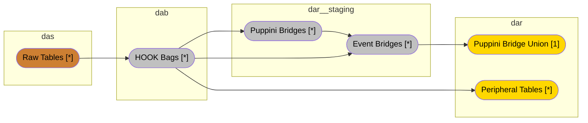

# ADSS+HOOK+USS Implementation Manual

## Architecture Overview



- **DAS** = Data According To System
- **DAB** = Data According To Business
- **DAR** = Data According To Requirements

## Chapter 1: Data According to System (DAS)

### Purpose
The DAS layer is an append-only view of the data as-is in the system. Not transformations allowed, except adding metadata like `loaded_at`.
The naming convention is `raw__source_system__table`.

### Implementation

#### Raw View Creation
```sql
MODEL (
  kind VIEW,
  enabled TRUE,
  description 'Raw viewpoint of entity_name data: Original description'
)

SELECT
    column_name::BIGINT,
    date_column::DATE,
    text_column::TEXT,
    NOW()::TIMESTAMPTZ AS loaded_at
FROM ICEBERG_SCAN("file://lakehouse/das/raw__source_system__table/")
```

## Chapter 2: Data According to Business (DAB)

### Purpose
The DAB layer models the tables from the business point of view, using Hook methodology.
The basic concept of Hook is to "tag" core business concepts in each table.

This creates a outside-in approach to data modeling, where the hooks are added to align with the business concepts, while keeping the source system schema.
This is also the place where we do some light transformations, e.g., ensuring correct data types.

The naming convention is `bag__source_system__table`.

### Implementation

#### Stage 1: Staging Transformation
To work seamlessly with the Unified Start Schema downstream, we need to rename the columns so that they are unique within the architecture.
This is usually done by prefixing the column names with the table name, i.e. `table` from `bag__source_system__table`.

```sql
WITH staging AS (
  SELECT
    col1 AS column_prefix__col1,
    col2 AS column_prefix__col2,
    modified_date AS column_prefix__modified_date,
    loaded_at AS column_prefix__record_loaded_at
  FROM das.raw__source_system__table
),
```

#### Stage 2: Validity Transformation
In this step we create record versioning by adding valid to & from and similar fields.
```sql
validity AS (
  SELECT
    *,
    -- Create versioned records
    ROW_NUMBER() OVER (
      PARTITION BY column_prefix__business_key_field 
      ORDER BY column_prefix__record_loaded_at
    ) AS column_prefix__record_version,
    
    -- Define validity periods
    CASE
      WHEN column_prefix__record_version = 1
      THEN '1970-01-01 00:00:00'::TIMESTAMP
      ELSE column_prefix__record_loaded_at
    END AS column_prefix__record_valid_from,
    
    COALESCE(
      LEAD(column_prefix__record_loaded_at) OVER (
        PARTITION BY column_prefix__business_key_field 
        ORDER BY column_prefix__record_loaded_at
      ),
      '9999-12-31 23:59:59'::TIMESTAMP
    ) AS column_prefix__record_valid_to,
    
    -- Identify current record
    column_prefix__record_valid_to = '9999-12-31 23:59:59'::TIMESTAMP AS column_prefix__is_current_record,
    
    -- Set record update timestamp
    CASE
      WHEN column_prefix__is_current_record
      THEN column_prefix__record_loaded_at
      ELSE column_prefix__record_valid_to
    END AS column_prefix__record_updated_at
  FROM staging
),
```

#### Stage 3: Hooks Transformation
Now it's time to create hooks for each concept.
```sql
hooks AS (
  SELECT
    -- Regular hook creation
    CONCAT('keyset|', column_prefix__business_key_field) AS _hook__concept__qualifier,
    
    -- Composite key hook creation (when needed)
    CONCAT_WS('~', 
      component_hook1, 
      component_hook2
    ) AS _hook__composite_entity,
    
    -- Point-in-time (PIT) hook generation
    CONCAT_WS('~',
      _hook__primary,
      'epoch__valid_from|'||column_prefix__record_valid_from
    ) AS _pit_hook__concept__qualifier,
    
    *
  FROM validity
)
```

These three steps are done in the same model.

## Chapter 3: Data According to Requirements (DAR)

### Purpose
The DAR layer builds a layer that are to be used for data analysis and reporting.
We will utilize the Unified Star Schema for this.

The basic concept of the Unified Star Schema is a bridge that holds all the relations between the different tables (peripherals).
In this methodology a peripheral table can act as both a fact & a dimension.

### 3.1 Bridge Layer (DAR Staging)

#### Stage 1: Base Bridge Transformation
We start by extracting the hooks from the corresponding bag.
We keep both the primary hook and it's PIT sibling, the regular hook might be used by downstream bridges to resolve the PIT hook.
```sql
WITH cte__bridge AS (
  SELECT
    'entity_name' AS peripheral,
    _pit_hook__primary,
    _hook__primary,
    -- Foreign hooks
    _hook__related1,
    _hook__related2,
    -- System fields
    column_prefix__record_loaded_at AS bridge__record_loaded_at,
    column_prefix__record_updated_at AS bridge__record_updated_at,
    column_prefix__record_valid_from AS bridge__record_valid_from,
    column_prefix__record_valid_to AS bridge__record_valid_to,
    column_prefix__is_current_record AS bridge__is_current_record
  FROM dab.bag__source_system__table
),
```

#### Stage 2: PIT Lookup Transformation
After we have these, we can resolve the PIT hooks using our validity ranges, by referencing the corresponding bridge table.
When we do this, we also update the validity metadata.
```sql
cte__pit_lookup AS (
  SELECT
    cte__bridge.peripheral,
    cte__bridge._pit_hook__primary,
    related_bridge._pit_hook__related,
    -- Additional PIT hooks
    cte__bridge._hook__primary,
    
    -- Temporal calculations
    GREATEST(
      cte__bridge.bridge__record_loaded_at,
      related_bridge.bridge__record_loaded_at
    ) AS bridge__record_loaded_at,
    
    GREATEST(
      cte__bridge.bridge__record_updated_at,
      related_bridge.bridge__record_updated_at
    ) AS bridge__record_updated_at,
    
    GREATEST(
      cte__bridge.bridge__record_valid_from,
      related_bridge.bridge__record_valid_from
    ) AS bridge__record_valid_from,
    
    LEAST(
      cte__bridge.bridge__record_valid_to,
      related_bridge.bridge__record_valid_to
    ) AS bridge__record_valid_to,
    
    LIST_HAS_ALL(
      ARRAY[True],
      ARRAY[
        cte__bridge.bridge__is_current_record,
        related_bridge.bridge__is_current_record
      ]
    ) AS bridge__is_current_record
  FROM cte__bridge
  LEFT JOIN dar__staging.bridge__related_entity AS related_bridge
    ON cte__bridge._hook__related = related_bridge._hook__related
    AND cte__bridge.bridge__record_valid_from >= related_bridge.bridge__record_valid_from
    AND cte__bridge.bridge__record_valid_to <= related_bridge.bridge__record_valid_to
),
```

#### Stage 3: Bridge PIT Hook Transformation
To ensure that we have a primary key for the bridge table, we need to add a unique identifier to it.
We do that by concatenating the peripheral value, the record valid from, and all the PIT hooks.
```sql
cte__bridge_pit_hook AS (
  SELECT
    *,
    CONCAT_WS(
      '~',
      'peripheral|'||peripheral,
      'epoch__valid_from|'||bridge__record_valid_from,
      _pit_hook__primary::TEXT,
      _pit_hook__related::TEXT
    ) AS _pit_hook__bridge
  FROM cte__pit_lookup
)
```

### 3.2 Event Layer (DAR Staging)
Before handing over the bridge to the DAR layer, we want to add the events so that each table has a connection to the canonical calendar.

This is also the place where we can define measures to be aggregated, that will give each measure a temporal anchor. After all, a measure should be connected to time.
This might require additional thinking.

Let's take invoice amount as an example. An invoice might have invoiced_at, invoice_due_date, invoice_payed_at, this implies that we have three measures: "Invoiced amount", "Due amount", "Paid amount".

#### Stage 1: Events Unpivoting Transformation
```sql
cte__events AS (
  SELECT
    pivot__events._pit_hook__primary,
    CONCAT('epoch__date|', pivot__events.event_date) AS _hook__epoch__date,
    MAX(CASE WHEN pivot__events.event = 'column_prefix__date_field1' THEN 1 END) AS event__entity_event1,
    MAX(CASE WHEN pivot__events.event = 'column_prefix__date_field2' THEN 1 END) AS event__entity_event2
  FROM dab.bag__source_system__table
  UNPIVOT (
    event_date FOR event IN (
      column_prefix__date_field1,
      column_prefix__date_field2
    )
  ) AS pivot__events
  GROUP BY ALL
  ORDER BY _hook__epoch__date
),
```

#### Stage 2: Event PIT Hook Transformation
After exploding the events, we also need to update the primary key for the bridge by adding the hook to the canonical calendar.
```sql
final AS (
  SELECT
    *,
    CONCAT_WS(
      '~',
      _pit_hook__bridge::TEXT,
      _hook__epoch__date::TEXT
    ) AS _pit_hook__bridge
  FROM cte__bridge
  LEFT JOIN cte__events USING(_pit_hook__primary)
)
```

### 3.3 Bridge Union (DAR)
Now we take all the event tables and union them to create a single table holding all connections.
This can be modularized so that we have a bridge containing tables and bridges that regards sales, and another for finance.

We can also adjust the temporal view. The basic one is an `as_of` temporal view, where the user have to manually specify the validity period.
Or, we can filter it by `ìs_current` to retrieve how the data looks right now, `as_is`.
The third, and my favorit, is by select them where the hook date is between the valid from and to, to create a `as_of_event`bridge. I.e., how the relations looked when something happened.
```sql
WITH cte__bridge_union AS (
  SELECT * FROM dar__staging.events__entity1
  UNION ALL BY NAME
  SELECT * FROM dar__staging.events__entity2
  -- Additional event models
)

SELECT
  peripheral::TEXT,
  _pit_hook__bridge::BLOB,
  _pit_hook__entity1::BLOB,
  _pit_hook__entity2::BLOB,
  -- Additional PIT hooks
  _hook__epoch__date::BLOB,
  event__entity1_event1::INT,
  event__entity1_event2::INT,
  event__entity2_event1::INT,
  -- Additional event fields
  bridge__record_loaded_at::TIMESTAMP,
  bridge__record_updated_at::TIMESTAMP,
  bridge__record_valid_from::TIMESTAMP,
  bridge__record_valid_to::TIMESTAMP,
  bridge__is_current_record::BOOL
FROM cte__bridge_union
```

### 3.4 Peripheral Views (DAR)
This is the easiest table type, just select the primary PIT hook and other types of fields, disgarding the other hooks.
```sql
MODEL (
  enabled TRUE,
  kind VIEW,
  tags unified_star_schema,
  grain (_pit_hook__primary),
  description 'Business viewpoint of entity_name data: Original description'
)

SELECT
  *
  EXCLUDE (_hook__entity, _hook__related)
FROM dab.bag__source_system__table
```

## Key Concepts

1. **Hooks**: Business entity identifiers that follow the pattern `_hook__concept__qualifier`
2. **PIT Hooks**: Point-in-time hooks that combine entity identifiers with validity timestamps
3. **Outside-In Approach**: Decoupling business modeling from data acquisition
4. **Temporal Handling**: Full history with valid-from and valid-to timestamps
5. **Bridges**: Connecting different entity types with temporal alignment